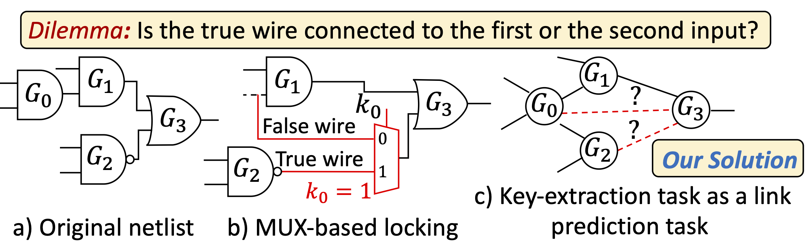

# UNTANGLE -- Unlocking Routing and Logic Obfuscation Using Graph Neural Networks-based Link Prediction
Lilas Alrahis, Satwik Patnaik, Muhammad Abdullah Hanif, Muhammad Shafique, and Ozgur Sinanoglu

---

**Contact**

Lilas Alrahis (lma387@nyu.edu)

### About

UNTANGLE is a link prediction-based attack on logic locking. This repository contains the python implementation of UNTANGLE attack in addition to the implementation of random MUX locking and InterLock.


### Setup
#### Step 1: Install the default GNN model (i.e., DGCNN)
```sh
$ git clone https://github.com/muhanzhang/pytorch_DGCNN
$ cd pytorch_DGCNN/lib
$ make -j4
$ cd ../..
```
#### Step 2: Install Required Packages
1) Install [PyTorch](https://pytorch.org/)
2) Install numpy, scipy, networkx, tqdm, sklearn, gensim

### Usage
#### Attacking Random Mux Locking
***1) Lock a design***
* First: Modify line 8 in `./prepare_datasets/perl_scripts/MUX_random_lock.pl` and place the full path to `theCircuit.pm` (This is done only once)
* Example, lock the c7552 ISCAS benchmark with key size of 256
```sh
$ cd ./prepare_datasets/perl_scripts/
$ perl MUX_random_lock.pl -k 256 -i ../test_c7552/ > log.txt
```
* `MUX_random_lock.pl` is a Perl script that reads a circuit in Bench format and locks it using 2-input MUXes. It will convert the design into a graph. It assigns unique numerical IDs (0 to N-1) to the nodes (gates). N represents the total number of nodes (gates) in the design.
* `-k` flag specifies the desired key size.
* It will generate a directory `../../data/c7552_MUX_K256` which includes:

  * The extracted features will be dumped in `feat.txt`. The ith line in feat.txt represent the feature vector of the node ID = the ith line in `count.txt`
  * The existence of an edge i between two vertices u and v is represented by the entry of ith line in `links_train.txt`
  * The `links_test.txt` and `link_test_n.txt` are created to identify the edges exclusive to the testing set. `links_test.txt` includes all the true MUX connections while `link_test_n.txt` includes all the false MUX connections
  * The `cell.txt` file includes the mapping between node IDs and gate instances
  * The `locked_MUX_2_K_256_c7552.bench` file represents the locked circuit

***2) Train UNTANGLE***
```sh
$ cd ../../
$ python Main.py --file-name c7552_MUX_K256 --train-name links_train.txt  --test-name links_test.txt --testneg-name link_test_n.txt --hop 2  --save-model > Log_train_c7552_MUX_K256.txt
```
***3) Get the predictions***
```sh
$ cd ../../
$ python Main.py  --file-name c7552_MUX_K256 --train-name links_train.txt  --test-name links_test.txt --hop 2  --only-predict > Log_pos_predict_c7552_MUX_K256.txt
$ python Main.py  --file-name c7552_MUX_K256 --train-name links_train.txt  --test-name  link_test_n.txt --hop 2  --only-predict > Log_neg_predict_c7552_MUX_K256.txt
```
* The likelihoods for the links will be dumped in `links_test_2__pred.txt` and `link_test_n_2__pred.txt`. Where `2` represents the hop size

***4) Parse the predictions***
 ```sh
 $perl break_MUX.pl c7552_MUX_K256
```
### Citation & Acknowledgement
If you find the code useful, please cite our paper:
* ICCAD 2021:
```
@INPROCEEDINGS{untangle,
  author={Alrahis, Lilas and Patnaik, Satwik and Hanif, Muhammad Abdullah and Shafique, Muhammad and Sinanoglu, Ozgur},
  booktitle={2021 IEEE/ACM International Conference On Computer Aided Design (ICCAD)}, 
  title={UNTANGLE: Unlocking Routing and Logic Obfuscation Using Graph Neural Networks-based Link Prediction}, 
  year={2021},
  volume={},
  number={},
  pages={1-9},
  doi={10.1109/ICCAD51958.2021.9643476}}
```
We owe many thanks to Muhan Zhang for making his [SEAL](https://github.com/muhanzhang/SEAL) code available.
